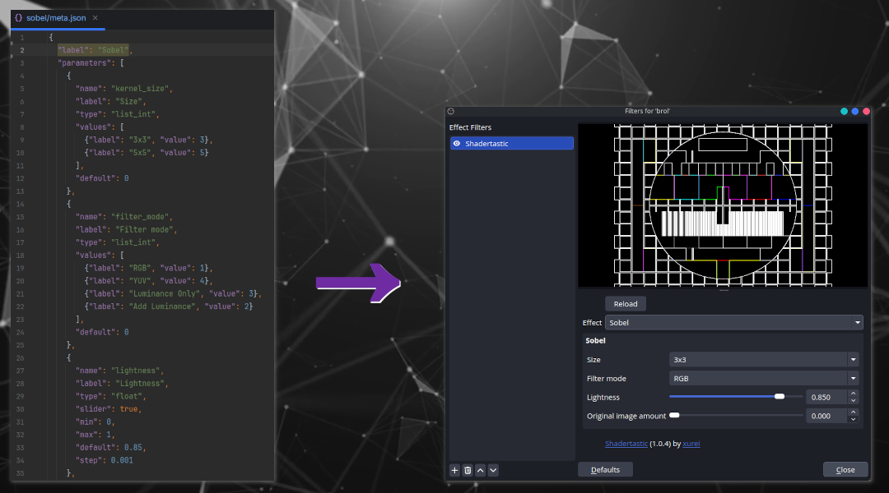

# Shadertastic
## User-friendly shader transitions and filters for OBS

Amazing transitions and filters using shaders, with user-friendly configurations.

Shadertastic is an OBS plugin designed to help you create custom filters and transitions, 
especially suited for streaming but adaptable for other media projects. 


## Features
### User-Friendliness at its core
*Other shader plugins exist. Why Shadertastic then?*  
Shadertastic has ease-of-use for the end-user as its main focus.
Every Shadertastic effect have a metadata file describing its parameters and their UI.   


### Easy Extensibility
Shadertastic comes with built-in, basic shaders. But you can **add your own** or other third-party filters and transitions without updating the plugin.

You want to write your own effects? No need to write any C++. All you need is to write the shader, its description and parameters.

Discover my own effects on https://www.shadertastic.com/library  
Learn to write your own effects: https://doc.shadertastic.com/effect-development/getting-started/  

## Build
### Prerequites
This is based on a fresh installation of Ubuntu Studio 26.04
- build-essential
- libobs-dev
- cmake
- extra-cmake-modules
- libjansson-dev
- qt6-base-dev
- patchelf

On Debian/Ubuntu, you can use : 
```bash
sudo apt install build-essential libobs-dev cmake extra-cmake-modules libjansson-dev qt6-base-dev patchelf
```

### Procedure
1. In-tree build
    - Build OBS Studio: https://obsproject.com/wiki/Install-Instructions
    - Check out this repository to plugins/shadertastic
    - Add `add_subdirectory(shadertastic)` to plugins/CMakeLists.txt
    - Rebuild OBS Studio

2. Stand-alone build (Linux only)
    - Verify that you have package with development files for OBS
    - Check out this repository and run `cmake -S . -B build -DBUILD_OUT_OF_TREE=On && cmake --build build`

# Donations
https://ko-fi.com/xurei  
https://github.com/sponsors/xurei

# Special mentions
- Face detection powered by ONNX™, inspired from https://github.com/intel/openvino-plugins-for-obs-studio
- ludolpif for its help finding memory leaks and the shader library